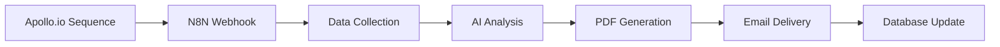
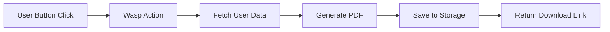

# PDF Generation Strategy

## Overview

Hyperformant implements a **dual PDF generation approach** based on use case and trigger source:

1. **Market Forces Reports** (N8N) - Automated, CRM-triggered reports sent to prospects
2. **Dashboard Exports** (Wasp) - User-initiated exports of dashboard and analytics data

Both approaches use React-PDF as the core technology but serve different business purposes and user flows.

## Architecture Decision

### Why Two PDF Systems?

**Different Use Cases Require Different Architectures:**

| Aspect         | Market Forces (N8N)                   | Dashboard Exports (Wasp)               |
| -------------- | ------------------------------------- | -------------------------------------- |
| **Trigger**    | Automated (Apollo.io sequences)       | User action (button click)             |
| **Recipient**  | External prospects                    | Logged-in users                        |
| **Content**    | AI-generated competitive intelligence | User's dashboard data                  |
| **Delivery**   | Email with professional templates     | Direct download/email                  |
| **Template**   | Market analysis format                | Dashboard/analytics format             |
| **Context**    | Sales automation pipeline             | User feature                           |
| **Processing** | Async (complex data gathering)        | Sync (user expects immediate response) |

## Market Forces PDF Generation (N8N)

### Purpose

Generate professional competitive intelligence reports automatically triggered by CRM workflows and delivered to prospects.

### Architecture



### Implementation Strategy

**N8N Workflow Nodes:**

1. **Webhook Trigger** - Receives report generation requests
2. **Data Collection** - Fetches company, sentiment, and vulnerability data
3. **AI Content Generation** - GPT-4o creates report content
4. **PDF Generation Service** - React-PDF renders professional template
5. **Email Delivery** - Resend sends with PDF attachment
6. **Database Update** - Saves report record and delivery status

### Report Templates

**Preview Report (3 pages):**

- Page 1: "The Customer Rebellion" - Top customer pain points
- Page 2: "The $X Million Blind Spot" - Market opportunities
- Page 3: "The Acquisition Target" - M&A prediction timeline

**Full Report (15-20 pages):**

- Executive Summary (1 page)
- Competitor Vulnerability Map (4 pages)
- Market Gap Intelligence (3 pages)
- M&A Opportunity Matrix (4 pages)
- Disruption Playbook (4-5 pages)
- Appendix (Data sources and methodology)

### Content Generation Flow

```typescript
// N8N workflow pseudocode
const reportRequest = {
  company_domain: 'example.com',
  report_type: 'preview|full',
  customer_email: 'prospect@company.com',
  triggered_by: 'apollo_sequence',
};

// 1. Fetch company data
const companyData = await fetchCompanyData(reportRequest.company_domain);

// 2. Gather market intelligence
const sentimentData = await fetchSentimentData(reportRequest.company_domain);
const vulnerabilities = await fetchVulnerabilities(
  reportRequest.company_domain
);
const maOpportunities = await fetchMAOpportunities(
  reportRequest.company_domain
);

// 3. AI content generation
const reportContent = await generateReportContent({
  company: companyData,
  sentiment: sentimentData,
  vulnerabilities: vulnerabilities,
  opportunities: maOpportunities,
  reportType: reportRequest.report_type,
});

// 4. PDF generation
const pdfBuffer = await generateMarketForcesPDF({
  content: reportContent,
  template: reportRequest.report_type,
  branding: { logo: 'hyperformant', footer: 'Confidential' },
});

// 5. Email delivery
await sendReportEmail({
  to: reportRequest.customer_email,
  subject: `Market Forces Analysis: ${companyData.name}`,
  pdfAttachment: pdfBuffer,
  template: 'market_forces_delivery',
});
```

### PDF Service Implementation

**Option 1: Dedicated PDF Service (Recommended)**

```typescript
// Separate Express service called by N8N
app.post('/generate-market-forces-pdf', async (req, res) => {
  const { reportContent, template, branding } = req.body

  const pdfBuffer = await generatePDF({
    component: <MarketForcesTemplate
      content={reportContent}
      template={template}
      branding={branding}
    />,
    format: 'A4',
    margins: { top: 20, bottom: 20, left: 20, right: 20 }
  })

  res.json({
    pdf_base64: pdfBuffer.toString('base64'),
    size_kb: Math.round(pdfBuffer.length / 1024)
  })
})
```

**Option 2: N8N Code Node**

```javascript
// Direct PDF generation in N8N workflow
const React = require('react');
const ReactPDF = require('@react-pdf/renderer');

const pdfBuffer = await ReactPDF.pdf(
  React.createElement(MarketForcesTemplate, {
    content: $node['Generate Report Content'].json,
    template: 'preview',
    branding: { logo: 'hyperformant' },
  })
).toBuffer();

return {
  pdf_base64: pdfBuffer.toString('base64'),
  filename: `${companyName}_Market_Forces_Analysis.pdf`,
};
```

## Dashboard PDF Exports (Wasp)

### Purpose

Allow logged-in users to export their dashboard data and analytics as PDF reports for offline viewing or sharing.

### Architecture



### Implementation Strategy

**Wasp Action Implementation:**

```typescript
export const generateDashboardExport: GenerateDashboardExport = async (
  { dashboardType, timeRange, format },
  context
) => {
  const { user } = context;

  // 1. Fetch user-specific data
  const dashboardData = await getDashboardData(
    user.id,
    timeRange,
    dashboardType
  );

  // 2. Generate PDF
  const pdfBuffer = await generateDashboardPDF({
    data: dashboardData,
    template: dashboardType,
    user: user,
    generatedAt: new Date(),
  });

  // 3. Save to user's files
  const file = await context.entities.File.create({
    data: {
      userId: user.id,
      filename: `${dashboardType}-export-${timeRange}.pdf`,
      content: pdfBuffer,
      mimeType: 'application/pdf',
      category: 'dashboard_export',
    },
  });

  return {
    fileId: file.id,
    downloadUrl: `/api/files/${file.id}/download`,
    filename: file.filename,
  };
};
```

### Dashboard Templates

**Market Forces Dashboard:**

- Current prospects and pipeline status
- Apollo.io performance metrics
- Recent market intelligence findings
- Revenue and conversion analytics

**Analytics Dashboard:**

- User engagement metrics
- Report generation statistics
- Revenue and subscription data
- Performance trends and insights

### PDF Components

```typescript
// Dashboard PDF template components
const DashboardPDFTemplate = ({ data, template, user, generatedAt }) => (
  <Document>
    <Page size="A4" style={styles.page}>
      <View style={styles.header}>
        <Text style={styles.title}>{getTemplateTitle(template)}</Text>
        <Text style={styles.subtitle}>Generated for {user.email}</Text>
        <Text style={styles.date}>{formatDate(generatedAt)}</Text>
      </View>

      <View style={styles.content}>
        {template === 'market-forces' && (
          <MarketForcesContent data={data} />
        )}
        {template === 'analytics' && (
          <AnalyticsContent data={data} />
        )}
      </View>

      <View style={styles.footer}>
        <Text>Hyperformant Dashboard Export - Confidential</Text>
      </View>
    </Page>
  </Document>
)
```

## Shared Infrastructure

### React-PDF Template System

**Common Base Components:**

```typescript
// Shared styling and components
const commonStyles = StyleSheet.create({
  page: {
    flexDirection: 'column',
    backgroundColor: '#ffffff',
    padding: 20
  },
  header: {
    marginBottom: 20,
    borderBottom: '1px solid #e0e0e0',
    paddingBottom: 10
  },
  title: {
    fontSize: 24,
    fontWeight: 'bold',
    color: '#1a1a1a'
  },
  // ... more shared styles
})

// Base template wrapper
const PDFTemplate = ({ children, title, footer }) => (
  <Document>
    <Page size="A4" style={commonStyles.page}>
      <View style={commonStyles.header}>
        <Text style={commonStyles.title}>{title}</Text>
      </View>
      <View style={commonStyles.content}>
        {children}
      </View>
      <View style={commonStyles.footer}>
        <Text>{footer}</Text>
      </View>
    </Page>
  </Document>
)
```

### Font and Asset Management

```typescript
// Register fonts for professional styling
Font.register({
  family: 'Inter',
  fonts: [
    { src: '/fonts/Inter-Regular.ttf' },
    { src: '/fonts/Inter-Bold.ttf', fontWeight: 'bold' },
    { src: '/fonts/Inter-Light.ttf', fontWeight: 'light' }
  ]
})

// Chart and image handling
const ChartImage = ({ chartData, type }) => {
  const chartImageUrl = generateChartImage(chartData, type)
  return <Image src={chartImageUrl} style={styles.chart} />
}
```

## Implementation Timeline

### Phase 1: N8N Market Forces PDF (Week 1)

1. **Set up PDF generation service** (Express + React-PDF)
2. **Create Market Forces templates** (preview and full report)
3. **Integrate with N8N workflows** (update existing Market Forces generator)
4. **Test end-to-end generation and delivery**

### Phase 2: Wasp Dashboard Exports (Week 2)

1. **Implement Wasp PDF generation action**
2. **Create dashboard templates** (Market Forces and Analytics)
3. **Add frontend export buttons** and download handling
4. **Test user experience and file management**

### Phase 3: Polish and Optimization (Week 3)

1. **Shared component library** for consistent styling
2. **Error handling and retry logic** for both systems
3. **Performance optimization** (caching, compression)
4. **Analytics and monitoring** for PDF generation success rates

## Technical Considerations

### Performance

- **Async Generation**: N8N handles time-intensive operations
- **Caching**: Cache frequently used data for faster generation
- **Compression**: Optimize PDF size without quality loss
- **CDN**: Store and serve PDFs via CDN for faster delivery

### Error Handling

- **N8N**: Retry logic with fallback notifications
- **Wasp**: User-friendly error messages with retry options
- **Monitoring**: Track generation success rates and failure reasons

### Security

- **Access Control**: User-specific data access in Wasp exports
- **Content Validation**: Sanitize data before PDF generation
- **File Storage**: Secure storage with expiration policies
- **Audit Logging**: Track PDF generation and access

### Scalability

- **Horizontal Scaling**: Multiple PDF service instances
- **Queue Management**: Handle high-volume generation requests
- **Resource Limits**: Prevent memory issues with large datasets
- **Background Processing**: Async generation for large reports

This dual approach ensures optimal user experience for both automated business processes and user-initiated features while maintaining code reusability and consistent branding.
