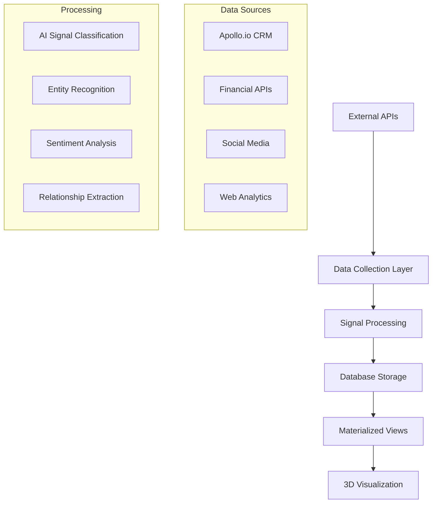

# Hyperformant Data Sources

Extensible data collection system for populating competitive intelligence visualization with real-time market data.

## 🏗️ Architecture Overview



## 📊 Configured Data Sources

### **Phase 1: High-Impact Sources**

| Source | Type | Trust Score | Signal Types | Update Frequency |
|--------|------|-------------|--------------|------------------|
| **Apollo.io CRM** | `APOLLO_CRM` | 95% | Customer Win/Loss, Exec Changes, Funding | Real-time + 4h batch |
| **Apollo.io Webhooks** | `APOLLO_WEBHOOK` | 95% | Sequence Engagement, Replies | Real-time |
| **Alpha Vantage** | `FINANCIAL_API` | 95% | Earnings, Analyst Forecasts, IPOs | Daily |
| **Crunchbase** | `FINANCIAL_API` | 90% | Funding Rounds, M&A, Leadership | Daily |
| **Reddit** | `SOCIAL_API` | 70% | Product Discussions, Sentiment | 2h |
| **Twitter** | `SOCIAL_API` | 80% | Executive Communications, Launches | 2h |
| **HackerNews** | `SOCIAL_API` | 85% | Tech Community Sentiment | 2h |
| **SimilarWeb** | `WEB_ANALYTICS` | 80% | Traffic Analytics, SEO Changes | Daily |
| **BuiltWith** | `WEB_ANALYTICS` | 75% | Tech Stack Changes | Daily |
| **Patent APIs** | `PATENT_API` | 90% | Innovation Tracking, R&D Direction | Daily |

## 🚀 Quick Start

### 1. Initialize Data Sources

```bash
# Run database migration
npm run db:migrate

# Initialize data sources in database
curl -X POST http://localhost:3000/api/admin/data-sources/init \
  -H "Authorization: Bearer YOUR_ADMIN_TOKEN"
```

### 2. Test Data Pipeline

```bash
# Run comprehensive test suite
npm run test:data-pipeline

# Check data source health
curl http://localhost:3000/api/admin/data-sources/init
```

### 3. Manual Data Collection

```bash
# Discover Apollo.io companies
curl -X POST http://localhost:3000/api/admin/data-sources/collect \
  -H "Content-Type: application/json" \
  -d '{
    "sourceType": "APOLLO_CRM",
    "action": "discover_companies",
    "params": {
      "keywords": ["saas", "fintech"],
      "employeeRanges": ["11-50", "51-200"],
      "limit": 25
    }
  }'

# Sync specific organization
curl -X POST http://localhost:3000/api/admin/data-sources/collect \
  -H "Content-Type: application/json" \
  -d '{
    "sourceType": "APOLLO_CRM", 
    "action": "sync_organization",
    "params": { "domain": "example.com" }
  }'
```

## 📡 Webhook Integration

### Apollo.io Webhooks

Configure Apollo.io webhooks to point to:
```
POST https://your-domain.com/api/webhooks/apollo
```

**Supported Events:**
- `contact.replied` → Generates `CUSTOMER_WIN` signals
- `contact.opened` → Generates `ENGAGEMENT` signals  
- `contact.clicked` → Generates `ENGAGEMENT` signals
- `contact.bounced` → Generates `CUSTOMER_LOSS` signals
- `sequence.finished` → Generates `ENGAGEMENT` signals

**Security:**
- HMAC-SHA256 signature verification
- Configurable webhook secrets
- Automatic ingestion run tracking

## 🔄 N8N Automation

### Apollo Sync Workflow

Import `n8n/workflows/apollo-sync-workflow.json` to N8N:

**Features:**
- Scheduled discovery (every 4 hours)
- Manual trigger via webhook
- Sequence metrics synchronization
- Materialized view refresh
- Error handling and logging

**Endpoints:**
- Webhook: `http://n8n-instance/webhook/apollo-sync`
- Manual API: `POST /api/admin/data-sources/collect`

### Workflow Configuration

1. **Install N8N Credentials:**
   - HTTP Basic Auth for API endpoints
   - PostgreSQL connection for logging

2. **Environment Variables:**
   ```bash
   N8N_WEBHOOK_URL="http://localhost:5678"
   N8N_API_KEY="your-n8n-api-key"
   ```

3. **Deploy Workflow:**
   ```bash
   # Import to N8N development
   npm run import:dev
   
   # Import to N8N production  
   npm run import:prod
   ```

## 🎯 Signal Generation

### Signal Types by Category

```typescript
// Market Intelligence
FUNDING_ROUND, IPO, ACQUISITION, MERGER, ANALYST_FORECAST

// Competitive Intelligence  
COMPETITOR_LAUNCH, PRICING_CHANGE, MARKET_ENTRY, PRODUCT_LAUNCH

// Customer Intelligence
CUSTOMER_WIN, CUSTOMER_LOSS, CUSTOMER_FEEDBACK, PRODUCT_REVIEW

// Executive Intelligence
EXEC_HIRE, EXEC_DEPARTURE, EXEC_TWEET

// Technology Intelligence
TECH_STACK_CHANGE, WEBSITE_UPDATE, INTEGRATION_LAUNCH, API_CHANGE

// Social Intelligence
SOCIAL_MENTION, REDDIT_DISCUSSION, PRESS_MENTION

// Web Intelligence  
TRAFFIC_SPIKE, TRAFFIC_ANOMALY, SEO_RANK_CHANGE

// Innovation Intelligence
PATENT_APPLICATION, PATENT_FILED, INNOVATION_SIGNAL
```

### Signal Processing Pipeline

```typescript
// 1. Raw Data Collection
const rawData = await apolloClient.searchOrganizations(criteria);

// 2. Entity Processing
const entityId = await apolloProcessor.processOrganization(org);

// 3. Signal Generation
await signalGenerator.generateSignal({
  entityId,
  signalType: 'FUNDING_ROUND',
  category: 'DEAL', 
  magnitude: 0.8,
  sentimentScore: 0.6,
  summary: 'Series A funding round',
  source: 'Crunchbase API',
  details: { amount: 5000000, series: 'A' }
});

// 4. Materialized View Refresh
await refreshMaterializedViews(['mv_signal_rollup']);
```

## 📈 Data Quality & Monitoring

### Ingestion Run Tracking

Every data collection operation creates an `IngestionRun` record:

```typescript
interface IngestionRun {
  id: string;
  dataSourceId: string;
  status: 'PENDING' | 'RUNNING' | 'SUCCESS' | 'FAILED';
  startedAt: DateTime;
  finishedAt?: DateTime;
  itemsIn?: number;    // Raw items processed
  itemsOut?: number;   // Signals generated
  error?: string;      // Error message if failed
  metadata?: Json;     // Processing details
}
```

### Health Metrics

```typescript
// Data source health monitoring
const health = await dataSourceManager.getDataSourceHealth(sourceId);

console.log({
  successRate: health.successRate,     // 0.0 - 1.0
  failureRate: health.failureRate,     // 0.0 - 1.0  
  lastRunAt: health.lastRunAt,         // DateTime
  lastStatus: health.lastStatus,       // RunStatus
  totalRuns: health.totalRuns          // number
});
```

### Data Quality Checks

- **Signal Validation**: Magnitude range (0-1), valid timestamps
- **Entity Deduplication**: Fuzzy matching on names/domains
- **Source Reliability**: Accuracy tracking over time
- **Rate Limiting**: Respects API limits and quotas

## 🔧 Configuration

### Environment Variables

```bash
# Apollo.io Integration
APOLLO_API_KEY="your-apollo-api-key"
APOLLO_WEBHOOK_SECRET="webhook-signature-secret"
APOLLO_WEBHOOK_VERIFY_TOKEN="verification-token"

# Financial APIs
ALPHA_VANTAGE_API_KEY="your-alphavantage-key"
CRUNCHBASE_API_KEY="your-crunchbase-key"

# Social APIs  
TWITTER_BEARER_TOKEN="your-twitter-token"
REDDIT_CLIENT_ID="your-reddit-client-id"
REDDIT_CLIENT_SECRET="your-reddit-secret"

# Web Analytics
SIMILARWEB_API_KEY="your-similarweb-key" 
BUILTWITH_API_KEY="your-builtwith-key"

# AI Processing
OPENAI_API_KEY="your-openai-key"
ANTHROPIC_API_KEY="your-anthropic-key"
GOOGLE_AI_API_KEY="your-google-ai-key"
```

### Rate Limiting

```typescript
// Configure in data source metadata
{
  rateLimits: {
    requests: 200,           // Requests per period
    period: "hour",          // minute/hour/day
    burst: 10               // Burst allowance
  },
  priority: "high",         // high/medium/low
  retryStrategy: "exponential_backoff"
}
```

## 🎨 Extending with New Sources

### 1. Add Data Source Type

```typescript
// Add to prisma/schema.prisma
enum DataSourceType {
  // ... existing types
  NEW_API_TYPE
}
```

### 2. Create Source Configuration

```typescript
// Add to src/lib/data-sources/index.ts
{
  name: 'New API Source',
  type: 'NEW_API_TYPE', 
  endpoint: 'https://api.example.com',
  trustScore: 0.85,
  signalTypes: ['NEW_SIGNAL_TYPE'],
  categories: ['MARKET'],
  rateLimits: { requests: 100, period: 'hour' }
}
```

### 3. Implement Processor

```typescript
// Create src/lib/data-sources/new-api.ts
export class NewApiProcessor {
  async processData(data: NewApiData): Promise<string> {
    // Entity processing logic
    const entityId = await this.createOrUpdateEntity(data);
    
    // Signal generation
    await this.signalGenerator.generateSignal({
      entityId,
      signalType: 'NEW_SIGNAL_TYPE',
      // ... signal parameters
    });
    
    return entityId;
  }
}
```

### 4. Add Collection Route

```typescript
// Update src/app/api/admin/data-sources/collect/route.ts
case 'NEW_API_TYPE':
  results = await handleNewApiCollection(action, params);
  break;
```

### 5. Create N8N Workflow

- Copy `apollo-sync-workflow.json`
- Update endpoints and parameters
- Configure scheduling and error handling
- Import to N8N instance

## 🚨 Troubleshooting

### Common Issues

**Data Source Not Found:**
```bash
# Reinitialize data sources
curl -X POST http://localhost:3000/api/admin/data-sources/init
```

**Webhook Signature Invalid:**
```bash
# Check APOLLO_WEBHOOK_SECRET in environment
# Verify signature format: sha256=<hash>
```

**Materialized Views Empty:**
```bash
# Refresh views manually
curl -X POST http://localhost:3000/api/viz/refresh-materialized-views

# Check view status
curl http://localhost:3000/api/viz/refresh-materialized-views
```

**Rate Limiting Errors:**
- Check API quotas and usage
- Adjust `rateLimits` configuration
- Implement retry logic with exponential backoff

### Monitoring

```bash
# Check ingestion run status
SELECT ds.name, ir.status, ir."startedAt", ir.error 
FROM "IngestionRun" ir 
JOIN "DataSource" ds ON ir."dataSourceId" = ds.id 
ORDER BY ir."startedAt" DESC LIMIT 10;

# Check signal generation
SELECT category, type, COUNT(*) as count
FROM "Signal" 
WHERE "timestamp" >= NOW() - INTERVAL '24 hours'
GROUP BY category, type
ORDER BY count DESC;
```

## 🎯 Next Steps

1. **Set up API keys** for all configured sources
2. **Configure N8N workflows** for automated collection  
3. **Set up webhook endpoints** for real-time processing
4. **Add financial APIs** (Alpha Vantage, Crunchbase)
5. **Implement social monitoring** (Reddit, Twitter, HN)
6. **Add web analytics** (SimilarWeb, BuiltWith)
7. **Test 3D visualization** with real data streams

The data pipeline is now ready to transform your competitive intelligence platform from static seed data to a living, breathing market intelligence system! 🚀